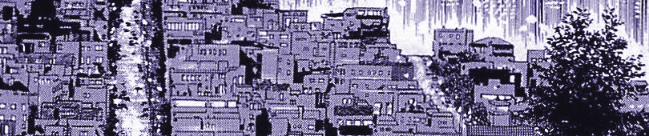
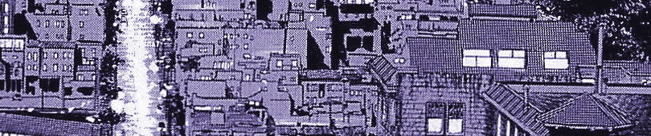
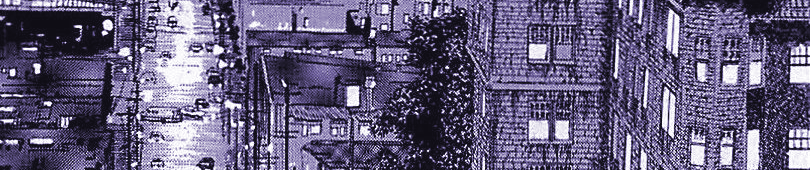
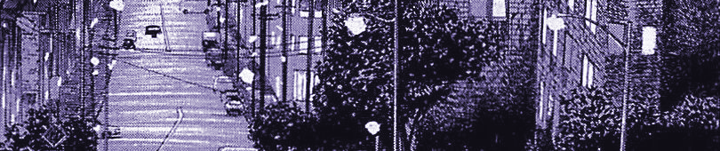

    

  

    <table style="max-width: 700px; margin: 0 auto;">
      <tr>
        <td align="center" width="120"></td>
        <td align="center" width="120"></td>
        <td align="center" width="120"></td>
        <td align="center" width="120"></td>
        <td align="center" width="120"></td>
        <td align="center" width="120"></td>
        <td align="center" width="120"></td>
      </tr>
      <tr>
        <td align="center" width="120"></td>
        <td align="center" width="120"></td>
        <td align="center" width="120"></td>
        <td align="center" width="120"></td>
        <td align="center" width="120"></td>
        <td align="center" width="120"></td>
        <td align="center" width="120"></td>
      </tr>
    </table>
  

  
### I am a student of computer science, mathematics, and physics. I am foremost a developer, and enjoy programming to solve people's problems.

### Experience
While working through my degree with collaborative projects at the University of Akron, I have also been employed on-campus in various student roles in IT repair, systems administration, helpdesk administration, and - now currently - I work as a web designer for the Buchtel College of Arts & Sciences.

I have experience helping manage and contribute to the semester-long projects we get @UA through the CS program, which has made me what I am today as a developer. This has honed my skills in and focused me toward a degree engineering fullstack web applications; everything from wireframes to the deployment pipeline is my new trade and passion in life, and I am excited to move onto the next stage of life graduating soon in December (2024.)

### Internship
I have accepted an internship this summer with a startup company, using Vue/Koa/.NET/+ in the stack, deployed on Azure following a microservice architecture. I look to stay with the company if possible in the future, but the value of working on production software in this stack, for a product I believe in, is unmatched. This will make my second internship after completing one in the UA IT department as a SysAdmin. More details on the internship will come after I begin the position in May.

### Capstone Project
My class partner Nicholas Limbach and I our working on our capstone project, which I have come up with long-term plans to turn it into a business after college. It is software that allows businesses to draw live maps and have their own data & users interact with the rendered "floorspace." We are going all out on this idea combining 2 different Unity projects with a hefty web application to support different ways users can interface with and create these "floorspaces" themselves, or more specifically for their organization's venue. For many reasons, I cannot host the code publicly here, so for now my profile will only have some more inactive repositories.

---
